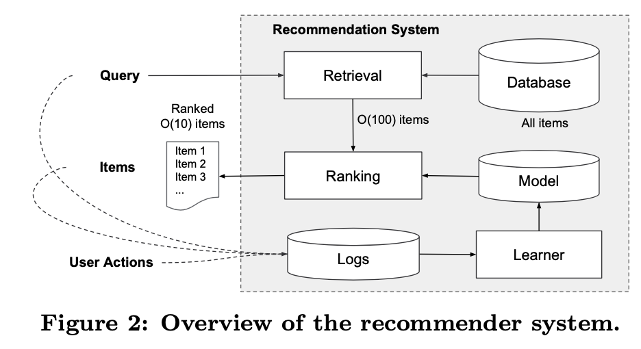
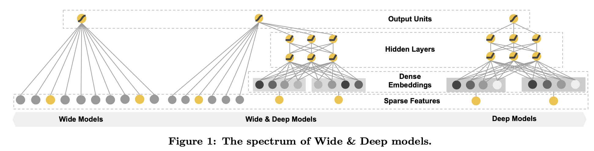
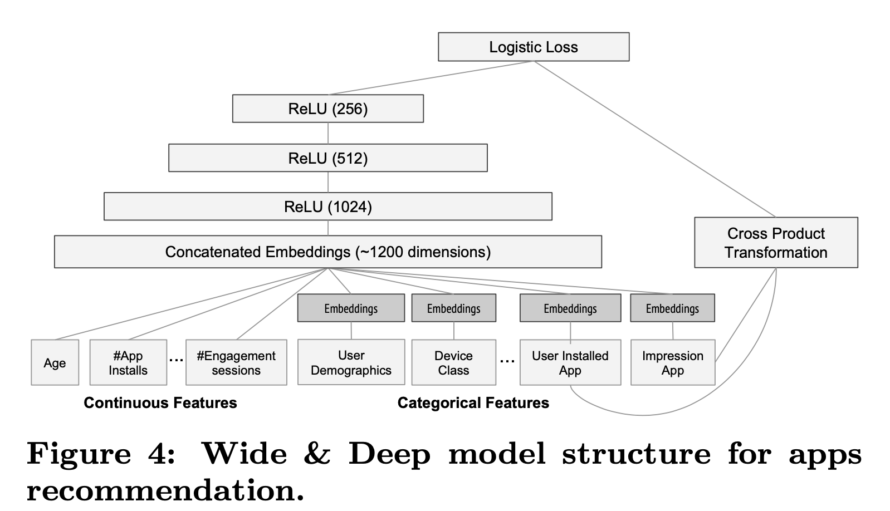

H.-T. Cheng _et al._, “Wide & Deep Learning for Recommender Systems,” _arXiv:1606.07792 \[cs, stat\]_, Jun. 2016, Accessed: Apr. 08, 2021. \[Online\]. Available: [http://arxiv.org/abs/1606.07792](http://arxiv.org/abs/1606.07792).

# 1. Introduction
## What is wide & deep?
Wide
- memorization of feature interactions through a wide set of cross-product feature transformations
- more feature engineering effort

Deep
- less feature engineering
- generalize better to unseen feature combinations

## Recommendation task
- find relevant items in a database
- rank the items based on certain objectives (clicks or purchases)
### Memorization
- learning the frequent co-occurrence of items or features and exploiting the correlation available in the historical data
- more topical and directly relevant to the items on which users have already bought
- using cross-product transformation
- logisitic Regression
- train on binarized featurs with one-hot encodding
	- `user_installed_app=netflix AND impression_app=pandora`: 1=true, 0=false
	-> limitation: do not generalize to unseen pairs

###	Generalization
- based on transitivity of correlation and explores new feature combinations that have never or rarely occurred in the past
- improve the diversity
- embedding-based models, such as factorziation machines or deep neural networks
- pros: can generalize to unseen query-item
	- learning a low-dimensional dense embedding vector for each query and item feature
- cons: 有的狀況反而使用 memorization 會更好，如 no interactions between most query-item pairs  

# 2. Recommender System Overview
<<<<<<< HEAD
![[wide_deep_2.png]]
=======

>>>>>>> a3f6d202dba09e1dc8c145fe723649b99eda2a5f
1. User input a query
2. Retireval: The recommender system returns a list of apps
	- items best match the query using various signals
		- a combination of machine-learned models
		- human defined rules
3. Ranking: the ranking system ranks all items by their scores
	- P(y|x): the probability of a user action label y given the features x
	- features:
		- user features: e.g., country language, demographics
		- contextual features: e.g., device, hour of the day, day of the week
		- impression features: e.g., app age, historical statistics of an app

# 3. Wide & Deep Learning

## 3.1 The Wide Component
- linear model $y=w^Tx+b$
- y: prediction
- $x = [x_1, x_2, ..., x_d]$ d features
- cross-product transformation
	- $\phi_k(x) = \prod x_i ^ {c_{ki}} \; c_{ki}\in\{0,1\}$
	- c_ki if 1 when the i-th feature is part of the k-th transformation
	- `AND(gender=female, language=en)`
		- 1: if and only if `gender=female AND language=en`
		- 0: otherwise
## 3.2 The Deep Component
- a feed-forward neural network
- input: feature strings
## 3.3 Joint Training of Wide and Deep Model
- The wide component and deep component are combined using a weighted sum of their output log odds
-> feed to [[logistic]] loss function for joint training

**Difference betwwen joint training and ensemble**
- [[ensemble]]
	- individual models are trained separately without knowing each other
	- predictions are combined only at ==inference time== but not at training time

- [[joint training]]
	- optimize all parameters simultaneously by taking both the wide and deep part as well as the weights of their sum into account at training time

# 4. System Implementaion

## 4.1 Data Generation
- Categorical data
- Continuous data

## 4.2 Model Training
- Wide components: cross-product transformation of user installed apps and impression apps
- Deep components: a 32-dimensional embedding vector is learned for each categorical feature
-> Concatenate embeddings and feed into 3 ReLU layers
